# Unlocking Customer Insights: On-Premises to Azure Data Pipeline with Databricks
## Business Request

Our company needs a deeper understanding of customer demographics and their buying behavior to better inform product strategies. We have a significant amount of customer data residing in an on-premises MySQL database. Key stakeholders require a data solution that provides high-quality data for a comprehensive KPI dashboard, with the ability to filter by product and market categories, perform date-based queries, and facilitate efficient analytical queries using a "One Big Table" approach to avoid expensive joins.

## Our Solution Overview

This project implements a robust data pipeline on Azure to address this need. The pipeline extracts data from the on-premises MySQL database, loads it into Azure Data Lake Storage (ADLS), transforms it using Azure Databricks, and creates a consolidated "One Big Table" in the Gold layer optimized for analytical queries. The pipeline is automated for daily execution, ensuring stakeholders have access to up-to-date information.

## Project Overview

This project builds an end-to-end data pipeline on Azure to extract, transform, and load (ETL) customer, product, market, and sales data from an on-premises MySQL database, ultimately generating actionable insights.

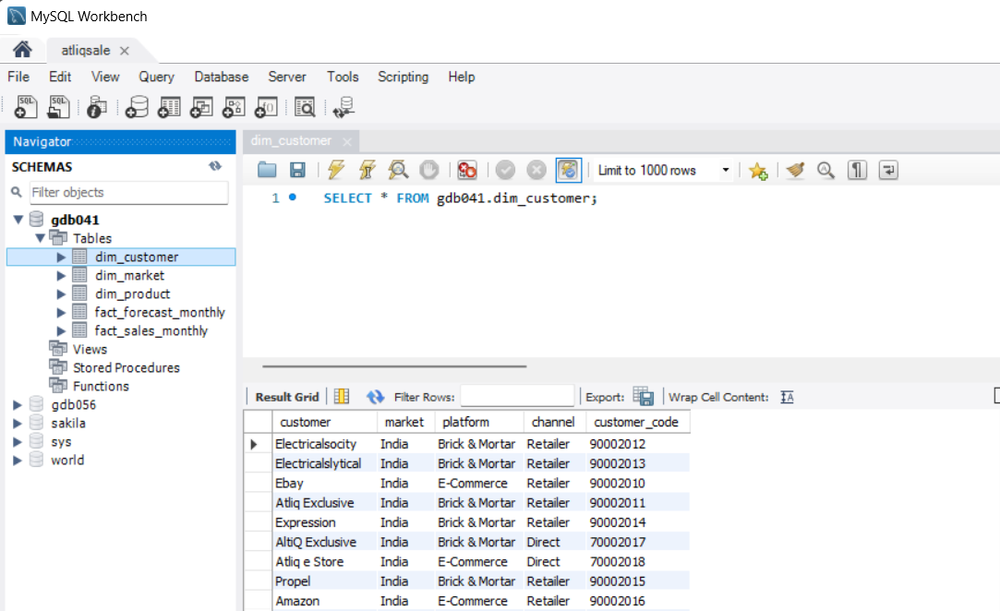
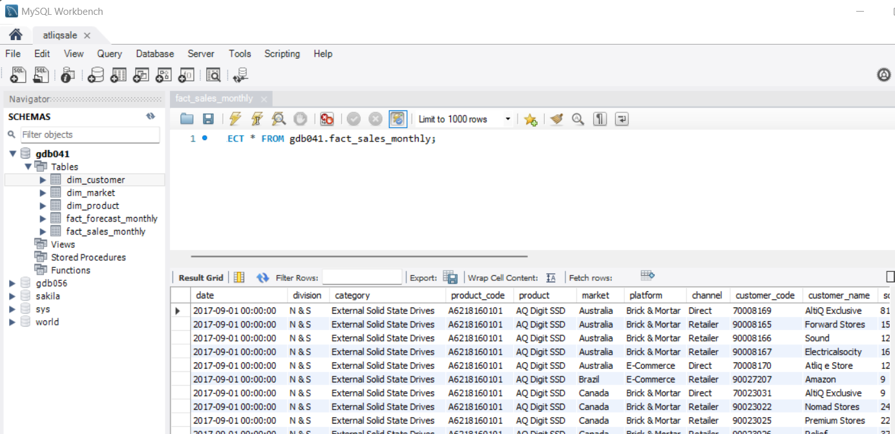
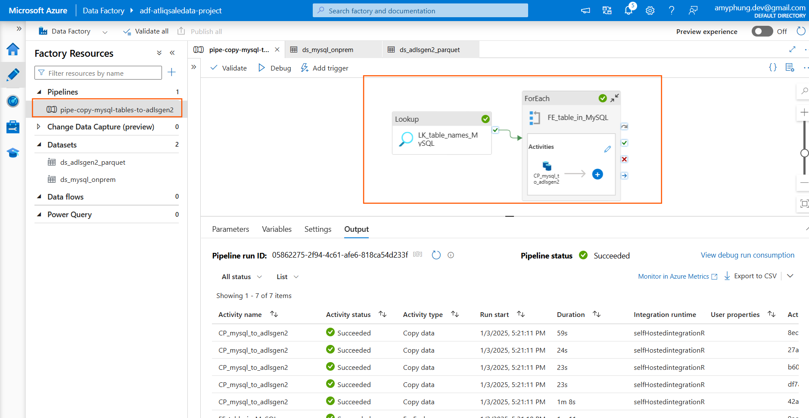
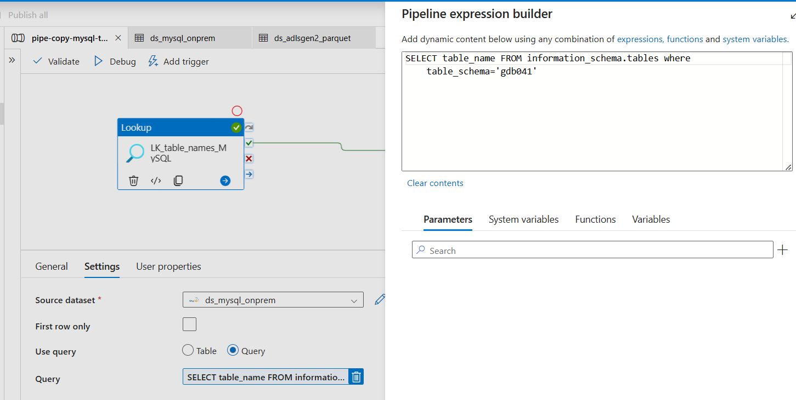
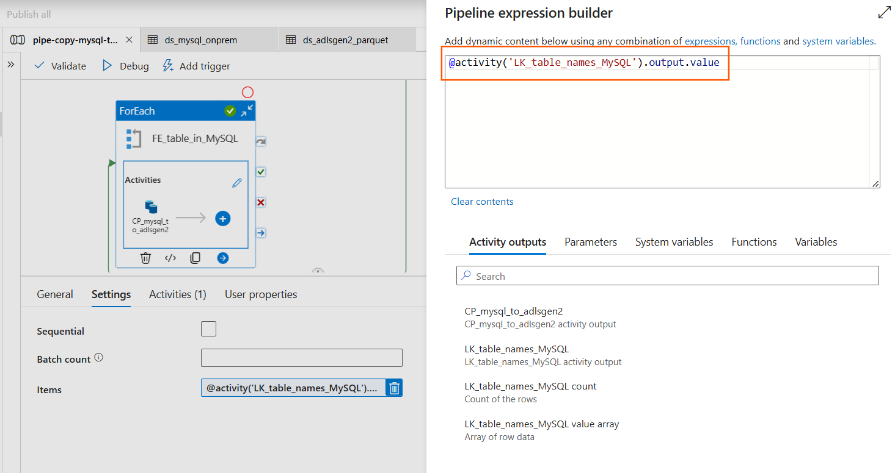
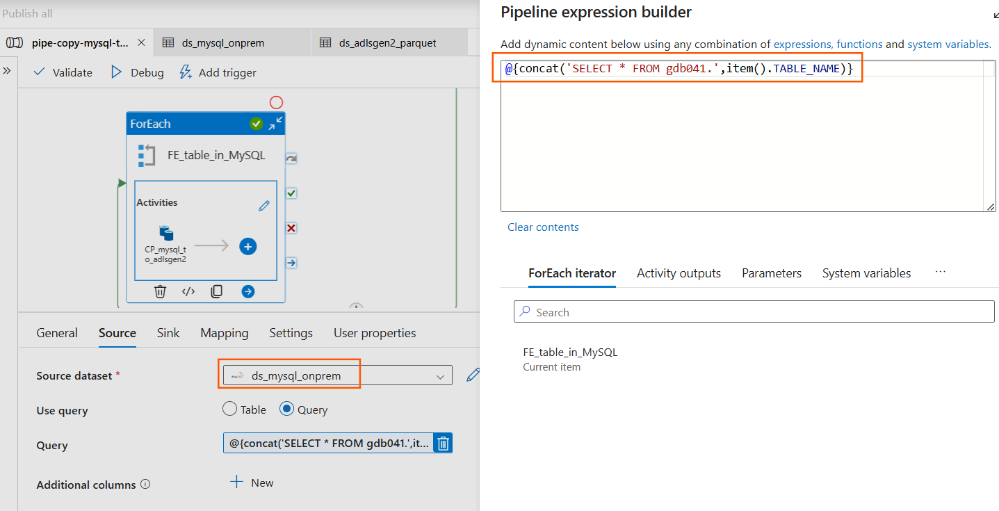
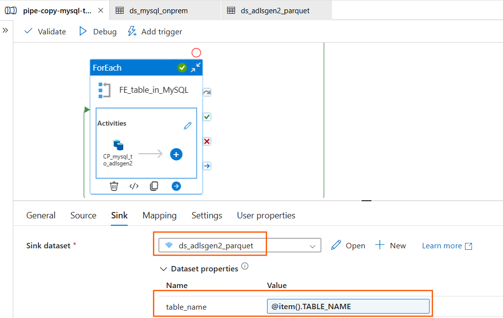
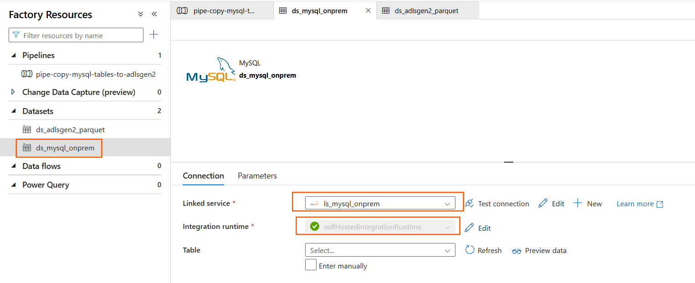
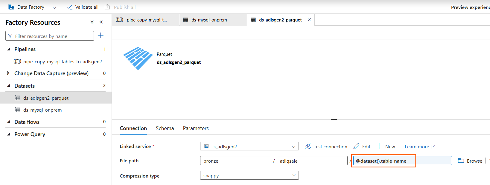
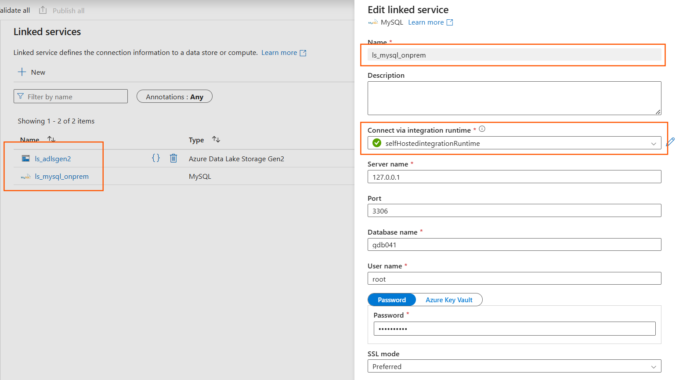
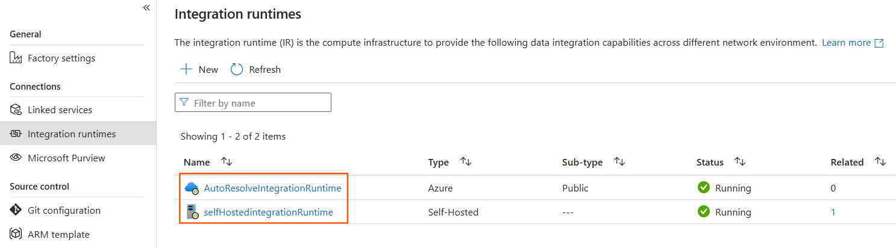
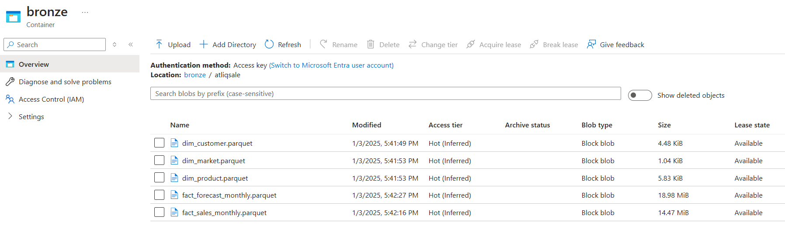
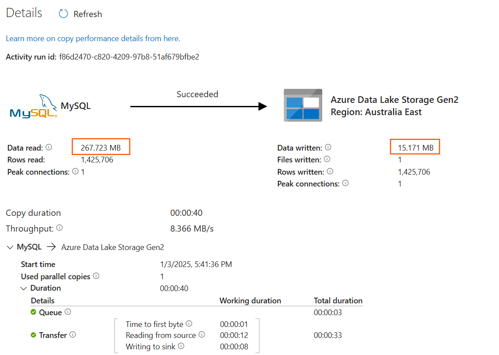
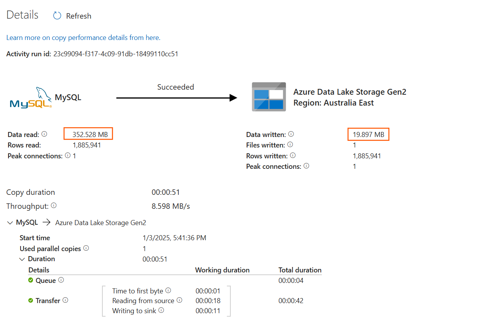
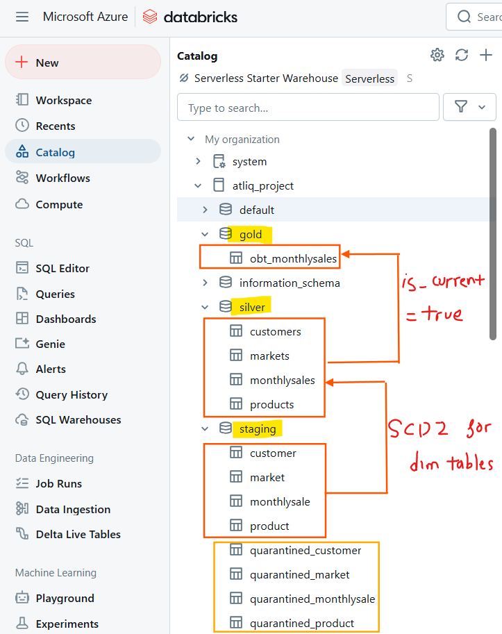
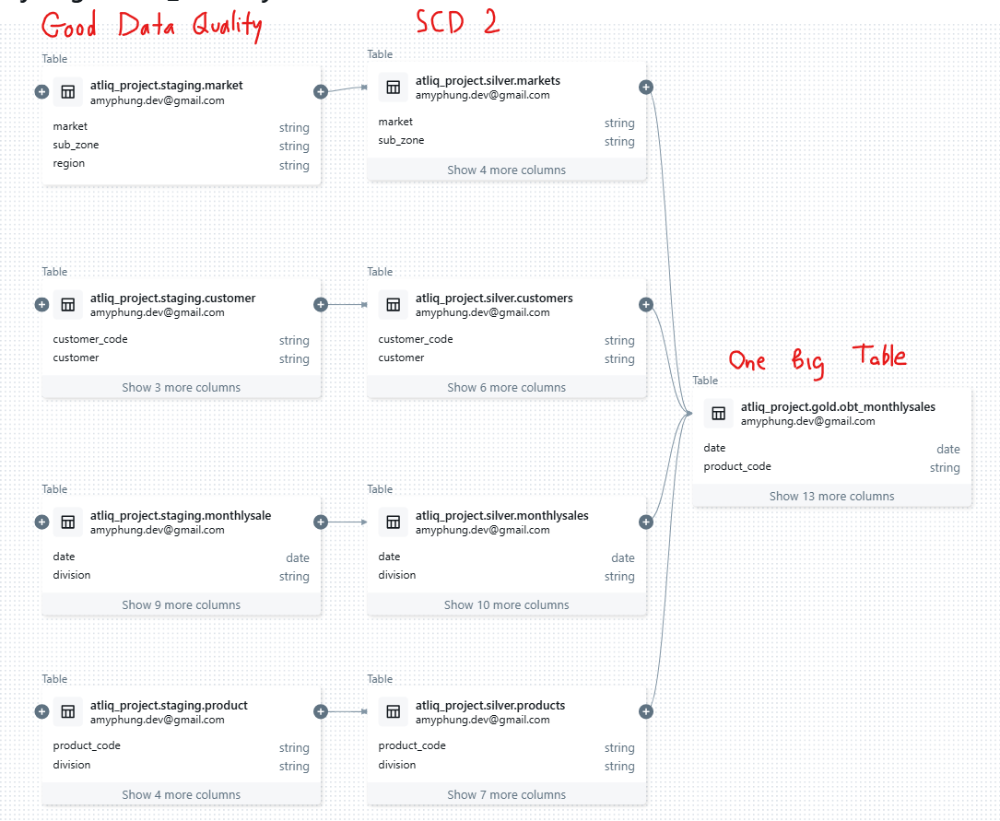
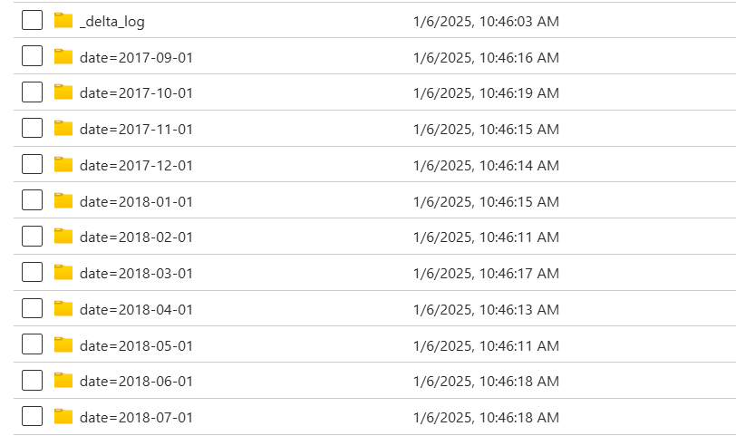

## Solution Architecture

The solution comprises the following components:

1.  **Data Ingestion:**
    *   Extract data from the on-premises MySQL database.
    *   Load the extracted data into the Bronze layer of Azure Data Lake Storage (ADLS) Gen2 using Azure Data Factory (ADF).

2.  **Data Transformation:**
    *   Utilize Azure Databricks for data cleaning, transformation, and aggregation.
    *   Implement a Bronze, Silver, and Gold data lakehouse architecture.
        *   **Bronze to Silver:** Clean and validate data, perform data quality checks. Data violating quality rules is moved to a quarantine table. Implement Slowly Changing Dimension (SCD) Type 2 for dimension tables.
        *   **Silver to Gold:** Create a "One Big Table" by joining dimension and fact tables using the latest values from the Silver layer, partitioned by date.

3.  **Automation:**
    *   Schedule the entire pipeline for daily execution using ADF.

## Technology Stack

*   **Azure Data Factory (ADF):** Orchestration of data movement and transformation.
*   **Azure Data Lake Storage (ADLS) Gen2:** Storage for raw (Bronze), refined (Silver), and aggregated (Gold) data.
*   **Azure Databricks:** Data transformation, processing, and analytics.
*   **Azure Key Vault:** Secure management of credentials and secrets.
*   **MySQL (On-Premises):** Source of customer, product, market, and sales data.

## Setup Instructions

### Step 1: Azure Environment Setup

1.  **Create Resource Group:** Create a new resource group in Azure to contain all project resources.
2.  **Provision Services:**
    *   Create an Azure Data Factory instance.
    *   Set up Azure Data Lake Storage Gen2 with `bronze`, `silver`, and `gold` containers.
    *   Create an Azure Databricks workspace.
    *   Configure Azure Key Vault for secure secret management.

### Step 2: Data Ingestion

1.  **On-Premises MySQL Setup:** Ensure the on-premises MySQL database containing AtliQ sales data is accessible.
2.  **Azure Data Factory Setup:**
    *   **Create Self-Hosted Integration Runtime:** This integration runtime will facilitate data transfer between on-premises MySQL and Azure.
    *   **Create Linked Services:**
        *   `ls-mysql-onprem`: Connects to the on-premises MySQL database using the self-hosted integration runtime.
        *   `ls-adlsgen2`: Connects to Azure Data Lake Storage Gen2 using the auto-resolved integration runtime.
    *   **Create Datasets:**
        *   `ds-mysql`: Represents the data in the MySQL database.
        *   `ds-adlsgen2-csv`: Represents the target location in ADLS Gen2 for initial data landing (Parquet format).
    *   **Ingest Data with ADF (Pipeline: `pipe-copy-mysql-tables-to-adlsgen2`):**
        *   **Lookup Activity:** Retrieves a list of all tables within the `Atliqsale` schema in the MySQL database.
        *   **ForEach Activity:** Iterates through each table retrieved by the Lookup activity.
        *   **Copy Activity (within ForEach):** Copies data from the current MySQL table to the Bronze layer in ADLS Gen2 in Parquet format for efficient storage and querying. Dynamic content is used to handle different table names.

### Step 3: Data Transformation (Databricks)

1.  **Metastore and Catalog Setup:** Configure a metastore and Unity Catalog within Databricks to manage table schemas and metadata. Configure fine-grained access control to data assets.
2.  **External Location Setup:** Configure Databricks to access the `bronze`, `silver`, and `gold` containers in ADLS Gen2.
3.  **Data Transformation Notebooks:** Implement Databricks notebooks to perform the following transformations:
    *   **Bronze to Silver:**
        *   Data cleaning and validation (e.g., handling nulls, data type conversions).
        *   Data quality checks and quarantine logic for invalid records.
        *   Implementation of SCD Type 2 for dimension tables (e.g., customer, product, market).
        *   Fact table partitioning by date.
    *   **Silver to Gold:**
        *   Creation of the "One Big Table" by joining dimension and fact tables using the latest values from the Silver layer.
        *   Partitioning the "One Big Table" by date.

### Step 4: Automation and Monitoring

1.  **Schedule Pipelines (ADF):** Configure triggers in ADF to schedule the data pipelines for daily execution.
2.  **Monitor Pipeline Runs (ADF):** Use ADF's monitoring capabilities to track pipeline execution, identify errors, and ensure data integrity.

### Step 5: End-to-End Testing

1.  **Trigger and Test Pipelines:** Insert new records into the on-premises MySQL database and trigger the ADF pipeline to verify the entire process, from ingestion to transformation and loading into the Gold layer. Validate the data in the "One Big Table."

## Conclusion

This project delivers a complete end-to-end solution for analyzing customer buying behavior and its impact on sales. The automated data pipeline provides stakeholders with consistent access to current and actionable insights, enabling data-driven decision-making.

## Future Enhancements

*   Implement more sophisticated data quality checks and monitoring.
*   Integrate with a visualization tool (e.g., Power BI) for creating dashboards and reports.
